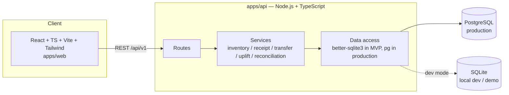
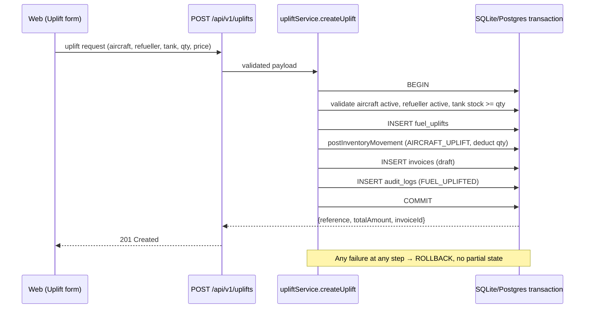
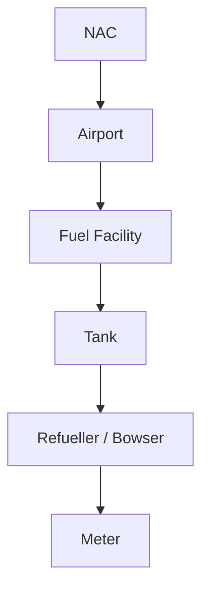

# Architecture

## System overview



## Layering

```
API request
  → Express route (validation with zod, RBAC middleware)
  → Service function (business rules, DB transaction boundary)
  → better-sqlite3 prepared statements (production: pg/Prisma against PostgreSQL)
```

The five business-critical engines are isolated in `apps/api/src/services/`
so they can be unit tested without an HTTP layer:

- `inventoryService.ts` — the immutable ledger: `postInventoryMovement()`
- `receiptService.ts` — receipt workflow state machine
- `transferService.ts` — tank/refueller transfers
- `upliftService.ts` — the core atomic aircraft-uplift transaction
- `reconciliationService.ts` — expected-vs-actual variance engine

Simpler CRUD (airports, suppliers, tanks master data, etc.) is implemented
directly in route handlers to avoid unnecessary indirection for the MVP;
this is a deliberate scope simplification, noted in the README.

## Aircraft uplift — the critical transaction

This is the spec's worked example (section 33) and the one most worth
getting right, since it touches inventory, billing and audit atomically:



## National → Airport → Tank drill-down



Reflected in the DB as `airports → fuel_facilities → tanks → refuellers →
meters`, and in the frontend as National Dashboard → Airport Dashboard →
Tank detail (via the inventory ledger view).

## Frontend architecture

- React Router for navigation; a single `AppShell` layout with grouped
  sidebar navigation matching the required UI page list (spec section 36)
- `AuthContext` holds the JWT and current user; `RequireAuth` gates the
  authenticated route tree
- A thin `api/client.ts` wraps `fetch`, attaches the bearer token, and
  normalizes errors
- Recharts for dashboard visualizations; no heavier charting dependency
  was justified for the MVP's chart set

## Why SQLite for the MVP, PostgreSQL for production

The brief asks for PostgreSQL as the primary database (section 22) and also
asks for a working, testable MVP with zero superficial features. Running
against SQLite via `better-sqlite3` lets the entire workflow — including
transactional guarantees via `db.transaction()` — be exercised locally
with no external services, while the schema in
`database/migrations/001_init.sql` is written and reviewed as the actual
PostgreSQL target. Porting the data-access layer (`apps/api/src/db`) to a
Postgres client is the main remaining infrastructure task before this can
run against a real Postgres instance; the service-layer business logic
above it does not need to change.

## Offline & IoT architecture

See `OFFLINE_SYNC.md` and `IOT_INTEGRATION.md` for the target architectures.
Both are designed but not fully implemented in this MVP; the relevant
tables (`sync_queue`, `iot_devices`, `iot_readings`) exist in the schema as
integration points.
