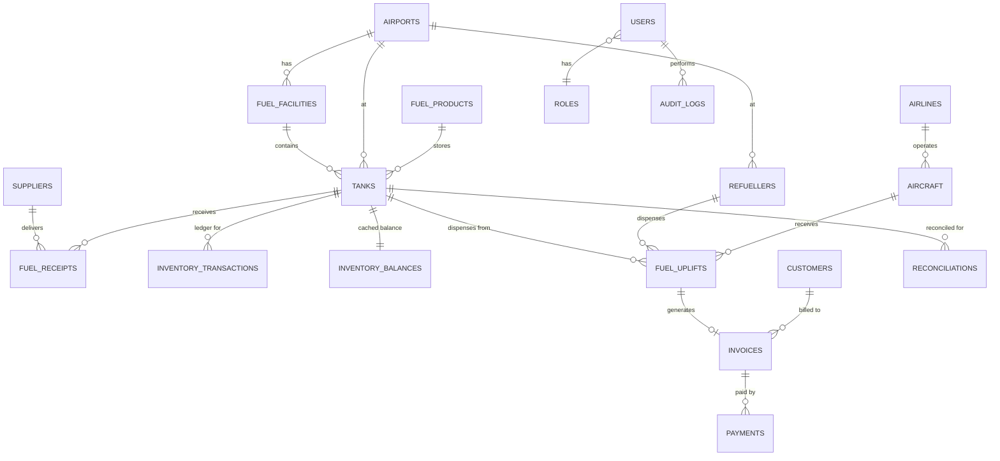

# Database

Two equivalent schemas exist:

- `apps/api/src/db/schema.sql` — SQLite, used for local dev / the runnable demo
- `database/migrations/001_init.sql` — PostgreSQL, the production schema of record

Both define the same 30 tables. Differences are only in type syntax
(`TEXT` vs `UUID`/`TIMESTAMPTZ`, SQLite's `datetime('now')` vs Postgres's
`now()`, and Postgres `CHECK` constraints that SQLite enforces at the
application layer instead).

## Core entity-relationship diagram



## Inventory ledger design (spec section 12)

The system never trusts a single "current stock" field as the source of
truth. Every fuel movement — receipt posting, transfer, aircraft uplift,
manual adjustment — writes an **immutable row** to
`inventory_transactions`:

```
opening_stock
  + RECEIPT
  + TRANSFER_IN
  − TRANSFER_OUT
  − AIRCRAFT_UPLIFT
  − LOSS
  ± ADJUSTMENT / CORRECTION
  = expected_closing_stock
```

`inventory_balances` is a **cache**, one row per tank, updated atomically
alongside every ledger insert (see `inventoryService.postInventoryMovement`).
It exists purely for fast reads (dashboards); it is always derivable by
replaying `inventory_transactions`, and reconciliation independently
recomputes it from the ledger rather than trusting the cache — see
`reconciliationService.runReconciliation`.

In production, `UPDATE`/`DELETE` grants on `inventory_transactions` and
`audit_logs` should be revoked from all application database roles, so
corrections are only ever possible by inserting new `CORRECTION` rows —
never by editing history.

## Reference number scheme

`NAC-<AIRPORT_CODE>-<TYPE>-<YYYYMMDD>-<sequence>`, e.g.
`NAC-POM-UPL-20260815-000123`. Generated in `utils/reference.ts` from a
per-day, per-airport, per-type count. `TYPE` is one of `RCT` (receipt),
`TRF` (transfer), `UPL` (uplift), `INV` (invoice).

## created_at / updated_at / created_by / updated_by / status

Applied consistently across master-data and workflow tables per the
brief's requirement (section 22). Immutable ledger/audit tables
(`inventory_transactions`, `audit_logs`) intentionally have no
`updated_at`/`updated_by` — they are append-only.
