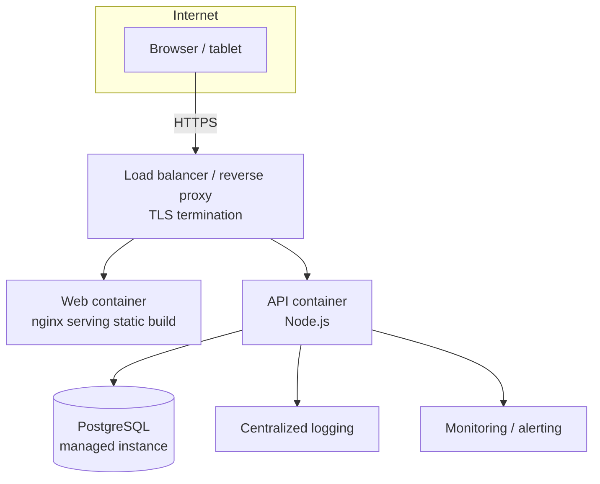

# Deployment

## Local development

See README.md "Quick start". No Docker required — `npm run dev` in each of
`apps/api` and `apps/web`.

## Docker Compose

```bash
cp .env.example .env   # edit JWT_SECRET at minimum
docker compose up --build -d
docker compose run --rm seed   # load demo data (DEMO / NOT REAL NAC DATA)
```

- Web app: http://localhost:8080
- API: http://localhost:4000 (proxied through the web container at `/api` too)
- API data persists in the `api-data` named volume (SQLite file)

## Deploying on Coolify

Coolify is a self-hosted PaaS that uses Traefik as a reverse proxy to route domain traffic to containerized applications.

1. **Create Resource**: In Coolify, create a new **Docker Compose** resource pointing to this repository and branch (`main`).
2. **Domain Configuration**: Configure your public domain (e.g., `https://nac-fms.example.com`) on the `web` service in the Coolify interface, pointing to internal port `80`.
3. **Environment Variables**: In the Coolify environment variable settings, set:
   - `JWT_SECRET`: A long, secure random string.
   - `CORS_ORIGIN`: Your public frontend domain (e.g., `https://nac-fms.example.com`).
   - `MAX_ALLOWED_VARIANCE_PCT`: `0.5` (or as required).
4. **Persistent Volume**: Ensure the named volume `api-data` is retained so the SQLite database (`/app/data/nac_fms.db`) persists across redeployments.
5. **Database Seeding**: After the initial deployment, run the one-off seed job using the `tools` profile to populate demo data via the Coolify terminal/exec interface or command line:
   ```bash
   docker compose --profile tools run --rm seed
   ```

## Target production topology



Recommended for a real NAC deployment:

- Managed PostgreSQL (with automated backups and point-in-time recovery —
  fuel and financial data should never depend on a single-file SQLite DB
  in production)
- TLS termination at a load balancer or reverse proxy in front of both
  containers (neither container terminates TLS itself)
- Deploy to Ubuntu Linux / VPS / cloud infrastructure as specified in the
  brief — the Docker images here are distro-agnostic and run anywhere with
  a container runtime

## Open deployment questions for NAC

These are genuinely NAC's decisions, not defaults this MVP should assume:

- **Hosting jurisdiction** for data sovereignty (see SECURITY.md)
- **Disaster recovery** RPO/RTO targets and backup cadence for PostgreSQL
- **Regional airport connectivity**: whether offline terminals (see
  OFFLINE_SYNC.md) run as installed tablet apps, browser-based PWAs, or
  something else — this affects the sync engine's implementation but not
  the central platform built here

## CI/CD pipeline

A sample GitHub Actions workflow is included at
`.github/workflows/ci.yml`, implementing the brief's requested pipeline
shape (GitHub → PR → automated tests → Docker build). Security scanning and
an actual staging/production deploy step are marked as TODO in the
workflow file — wiring those up depends on NAC's chosen hosting provider.

## Health checks

Both containers expose health checks:
- API: `GET /health` → `{ status: "ok", ... }`
- Web: nginx root response

## Environment variables

See `.env.example` for the full list. At minimum, override `JWT_SECRET`
before any non-local deployment.
