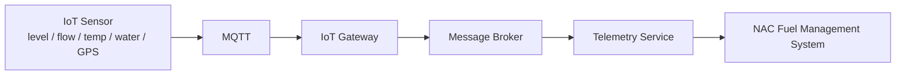

# IoT Integration

## Target architecture (spec section 21)

Future sensor types: tank level sensors, flow meters, temperature sensors,
water detection, GPS (for mobile refuellers), RFID (asset tracking), and
eventual PLC/SCADA integration at larger fuel farms.

## What's built in this MVP

`iot_devices` and `iot_readings` tables, plus:

- `GET /api/v1/iot/devices?airportId=` — registered devices
- `POST /api/v1/iot/devices` — register a device against a tank or refueller
- `GET /api/v1/iot/devices/:id/readings` — recent readings
- `POST /api/v1/iot/readings` — **simulated** ingest endpoint

The seed script (`apps/api/src/seed/seed.ts`) registers a handful of
`level_sensor` devices and generates simulated historical readings, so the
data model and read paths can be exercised end-to-end today.

## What's explicitly not built

`POST /iot/readings` stands in for the Telemetry Service's write path. A
real deployment would **not** expose a public POST endpoint for sensor
data — it would run an MQTT broker (e.g. Mosquitto or a managed IoT Core
service), a gateway process subscribing to sensor topics, and a telemetry
service that validates and writes readings server-side, with sensors never
talking to the REST API directly. This is flagged as
`TODO / FUTURE INTEGRATION` directly in the route source
(`apps/api/src/routes/iot.ts`) and in the IoT Devices screen in the web app.

## Why simulate rather than build the full pipeline

Standing up MQTT infrastructure, device provisioning/auth, and a telemetry
ingestion service is a substantial, mostly infrastructure-shaped project
independent of the fuel-management business logic this MVP is proving out.
Simulating readings at the data layer lets every downstream consumer —
tank dashboards, the low-stock alerting logic, future predictive
maintenance — be built and tested against realistic data now, with the
actual ingestion pipeline swappable in later without changing anything
above the `iot_readings` table.
